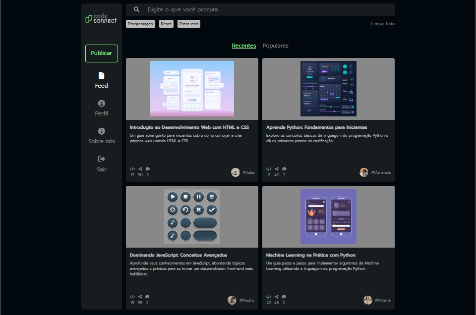

# CodeConnect - Feed

**CodeConnect** é uma rede social fictícia com foco na comunidade de desenvolvedores. O projeto, desenvolvido usando **React**, reproduz a página de feed da rede social, onde as postagens dos usuários são exibidas em cards criados dinâmicamente usando dados obtidos via API.

O projeto foi desenvolvido ao longo do curso **React: configurando e estruturando projetos com Vite** da escola de tecnologia **Alura**, tendo a professora **Mônica Mazzochi Hillman** como instrutora.

[Clique aqui para visualizar a página](https://code-connect-feed-git-main-thyagos-projects-e65f960c.vercel.app)

## Funcionalidades da aplicação:
- Obtenção de dados de API usando Axios.
- Renderização dos dados em cards de postagens dinâmicos.
- Responsividade básica.
- Efeitos decorativos em hover.

## Técnicas e tecnologias utilizadas:
- HTML, CSS e JavaScript 
- Vite
- React
- Axios
- Figma
